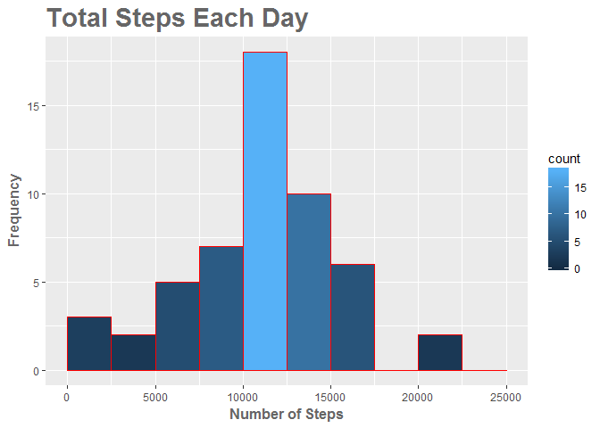
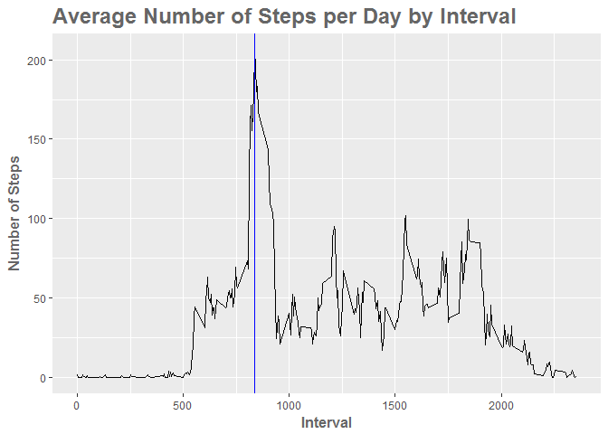
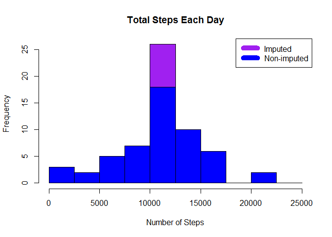

## Download and Prepare Data for Analysis 

Step 1. Download the Personal Activity Monitoring data.  
This assignment makes use of data from a personal activity monitoring device. This device collects data at 5 minute intervals through out the day. The data consists of two months of data from an anonymous individual collected during the months of October and November, 2012 and includes the number of steps taken in 5 minute intervals each day.  

The variables included in this dataset are:

* **steps:** Number of steps taking in a 5-minute interval (missing values are coded as NA)

* **date:** The date on which the measurement was taken in YYYY-MM-DD format

* **interval:** Identifier for the 5-minute interval in which measurement was taken

The dataset is stored in a comma-separated-value (CSV) file and there are a total of 17,568 observations in this dataset.

Code to download data (I'm not evaluting this code block because the file has already been downloaded):

```r
URL <- "https://d396qusza40orc.cloudfront.net/repdata%2Fdata%2Factivity.zip"
download.file(URL, destfile = "./activity.zip")
```
Step 2. Read data into a data frame

```r
unzip("./activity.zip", exdir="./data")
PersonalActivityData <- read.csv("./data/activity.csv")
```

## What is mean total number of steps taken per day?
Sum up steps by day, create histogram, and then calculate mean and median.  I chose to use gglot to gain some experiencee with a different plotting system.

```r
StepsByDay <- aggregate(steps ~ date, PersonalActivityData, sum)


ggplot(data=StepsByDay, aes(StepsByDay$steps)) + 
  geom_histogram(breaks=seq(0, 25000, by =2500), 
                 col="red", 
                 aes(fill=..count..)) +
  ggtitle("Total Steps Each Day") +
  labs(x="Number of Steps",y="Frequency") + 
  theme(plot.title = element_text(color="#666666", face="bold", size=22, hjust=0)) +
  theme(axis.title = element_text(color="#666666", face="bold", size=12)) 
```

<!-- -->

```r
rmean <- mean(StepsByDay$steps)
rmedian <- median(StepsByDay$steps)
```
The `mean` is 1.0766189\times 10^{4}  
The `median` is 10765.

## What is the average daily activity pattern?

* Calculate average steps for each interval for all days. 
* Plot the Average Number Steps per Day by Interval. 
* Find interval with most average steps. 

```r
StepsByInterval <- aggregate(steps ~ interval, PersonalActivityData, mean)

maxsteps <- StepsByInterval[which.max(StepsByInterval$steps),1]

ggplot(StepsByInterval, aes(x=interval, y=steps)) +
  geom_line() +
  ggtitle("Average Number of Steps per Day by Interval") +
  labs(x="Interval",y="Number of Steps")+
  theme(plot.title = element_text(color="#666666", face="bold", size=18, hjust=0)) +
  theme(axis.title = element_text(color="#666666", face="bold", size=12)) +
geom_vline(color="blue", xintercept = maxsteps)
```

<!-- -->

The 5-minute interval, on average across all the days in the data set, containing the maximum number of steps is 835.

## Impute missing values
1.Calculate and report the total number of missing values in the dataset


```r
sum(is.na(PersonalActivityData$steps))
```

```
## [1] 2304
```
Missing data needed to be imputed. Missing values were imputed by inserting the average number of steps for each interval.  

```r
ImputedData <- transform(PersonalActivityData, steps = ifelse(is.na(PersonalActivityData$steps), StepsByInterval$steps[match(PersonalActivityData$interval, StepsByInterval$interval)], PersonalActivityData$steps))
```

Recount total steps by day and create Histogram. 

```r
StepsByDayImp <- aggregate(steps ~ date, ImputedData, sum)


hist(StepsByDayImp$steps, main = paste("Total Steps Each Day"), col="purple", xlab="Number of Steps")

#Create Histogram to show difference. 
hist(StepsByDay$steps, main = "Total Steps Each Day", col="blue", xlab="Number of Steps", add=T)
legend("topright", c("Imputed", "Non-imputed"), col=c("purple", "blue"), lwd=10)
```

<!-- -->

Calculate new mean and median for imputed data. 

```r
rmean.i <- mean(StepsByDayImp$steps)
rmedian.i <- median(StepsByDayImp$steps)
```

Calculate difference between imputed and non-imputed data.

```r
mean_diff <- rmean.i - rmean
med_diff <- rmedian.i - rmedian
```

Calculate total difference.

```r
total_diff <- sum(StepsByDayImp$steps) - sum(StepsByDay$steps)
```
* The imputed data mean is 1.0766189\times 10^{4}
* The imputed data median is 1.0766189\times 10^{4}
* The difference between the non-imputed mean and imputed mean is 0
* The difference between the non-imputed mean and imputed mean is 1.1886792
* The difference between total number of steps between imputed and non-imputed data is 8.6129509\times 10^{4}. Thus, there were 8.6129509\times 10^{4} more steps in the imputed data.


## Are there differences in activity patterns between weekdays and weekends?
Create a panel plot to compare and contrast number of steps between the week and weekend. 

```r
Weekdays <- c("Monday", "Tuesday", "Wednesday", "Thursday", "Friday")

ImputedData$dow = as.factor(ifelse(is.element(weekdays(as.Date(ImputedData$date)),Weekdays), "Weekday", "Weekend"))

StepsByIntervalImp <- aggregate(steps ~ interval + dow, ImputedData, mean)

maxstepsImp <- StepsByIntervalImp[which.max(StepsByIntervalImp$steps),1]

library(lattice)

xyplot(StepsByIntervalImp$steps ~ StepsByIntervalImp$interval | StepsByIntervalImp$dow, main="Average Steps per Day by Interval",xlab="Interval", ylab="Steps",layout=c(1,2), type="l")
```

<!-- -->

There is a higher peak number of steps on weekdays, but it is in the same interval. Overall the were more intervals with a higher level of activity on the weekend days.

The interval with maximum number of steps in a weekend was 835 which is the same interval  for the maximum number of steps for weekdays.

